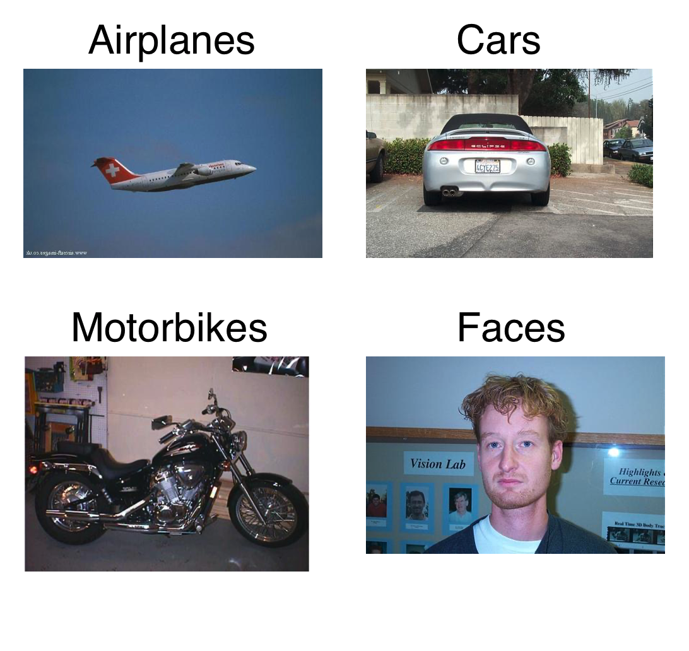
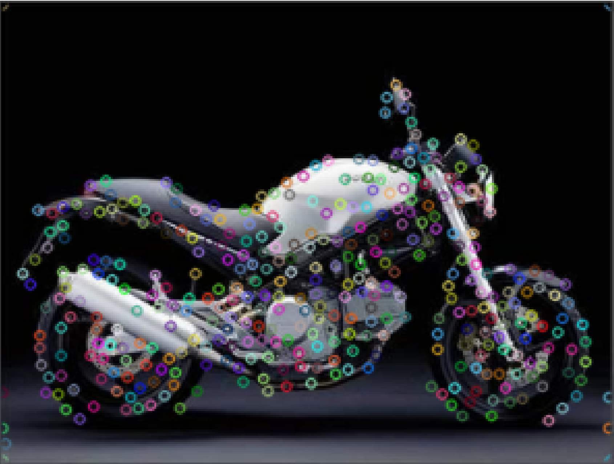

# Image Classification with Bag of Features

This project aims to classify the given 4-class dataset using bag of features.

## Dataset

The dataset used in this contains images and labels which belong to 4 different classes. 
These classes are cars, airplanes, motorbikes and faces. Sample images for all classes can be found below.

The dataset consists of 2 subdirectories which are training and validation. Each training set for each class 
contains 40 images and each validation set for each class contains 100 images. The dataset contains 560 images in total.

## Bag of Features Image Classification

### Feature extraction
#### Grid Method
In order to extract features out of an image properly we need to find the keypoints which are robust to transformation. 
First and the easiest approach used in this project is picking points which are the intersection points of a grid 
determined by the size of the image. An example image for this method can be found below.

As it can be seen from the picture above, most of the points are on the background which does not resemble the object 
we want to represent. In order to solve this issue we can make the spacing between the keypoints smaller so that more 
keypoints overlap with the object we want to represent. Below, an example with narrower spacing between keypoints is given.

#### OpenCV Good Features To Track Method
Corners can be used as keypoints in order to improve the overlapping percentage of the keypoints. As the third approach, 
built in feature extraction function of OpenCV is used. Example image with extracted keypoints using OpenCV good 
features to track function can be found below.

### Feature description

The scale-invariant feature transform (SIFT) is a feature detection algorithm in computer vision to detect and 
describe local features in images. In this project as feature descriptor SIFT is used.

### Dictionary computation

#### Mean Shift
Mean shift clustering aims to discover “blobs” in a sample space. In this project it is one of the methods to find the 
cluster centers of the SIFT descriptors. The mean shift algorithm does not require the number of classes it needs to 
find. This property of Mean Shift makes it suitable for our application because the number of classes we need to cluster
 is not predetermined. However this algorithm has drawbacks too. The time complexity is very high for using in 
 high-dimensional sample spaces.

#### K-Means
Kmeans algorithm is an iterative algorithm that tries to partition the dataset into pre-defined number of clusters. 
In this project like mean shift it is also used in order to find the cluster centers of the SIFT descriptors. 
One drawback of using SIFT is it requires the number of clusters beforehand which we do not know. However we can guess 
an arbitrary number of classes and tune it in order to benefit from the speed of k-means clustering.

### Feature quantization and histogram calculation

Nearest neighbor is the algorithm which finds the point in a given set that most similar to a given point. 
Before training the classifier we need to quantize our features which we have extracted from images and clustered 
according to their SIFT descriptions. In order to better represent the data histogram representation is used. 
All the data in the dictionary are converted to the histograms by measuring the distance between cluster centers.
 
### Classification

Support-vector machines (SVMs) are supervised learning models with associated learning algorithms that analyze data 
used for classification. In this project SVM is used to classify the given calculated histograms obtained from the 
training images.

### Results

All of the methods and their corresponding accuracy can be found in the table below.

| Feature Extraction         | Dictionary Computation | Accuracy  | Running Time \(seconds\) |
|----------------------------|------------------------|-----------|--------------------------|
| Grid\-0 \(8x8\)            | mean\-shift            | 65\.75\\% | 590\.42                  |
| Grid\-0 \(8x8\)            | kmeans: 50             | 86\.75\\% | 2\.82                    |
| Grid\-0 \(8x8\)            | kmeans: 250            | 88\.00\\% | 5\.00                    |
| Grid\-0 \(8x8\)            | kmeans: 500            | 91\.75\\% | 7\.61                    |
| Grid\-0 \(8x8\)            | kmeans: mean\-shift k  | 91\.00\\% | 761\.98                  |
| Grid\-1 \(12x12\)          | mean\-shift            | 65\.50\\% | 3355\.53                 |
| Grid\-1 \(12x12\)          | kmeans: 50             | 89\.50\\% | 4\.25                    |
| Grid\-1 \(12x12\)          | kmeans: 250            | 91\.50\\% | 10\.19                   |
| Grid\-1 \(12x12\)          | kmeans: 500            | 92\.00\\% | 16\.64                   |
| Grid\-1 \(12x12\)          | kmeans: mean\-shift k  | 92\.75\\% | 3922\.18                 |
| cv2 good features to track | mean\-shift            | 68\.50\\% | 18788\.53                |
| cv2 good features to track | kmeans: 50             | 92\.50\\% | 9\.09                    |
| cv2 good features to track | kmeans: 250            | 94\.75\\% | 26\.32                   |
| cv2 good features to track | kmeans: 500            | 92\.75\\% | 44\.79                   |
| cv2 good features to track | kmeans: mean\-shift k  | 67\.75\\% | 19345\.12                |

